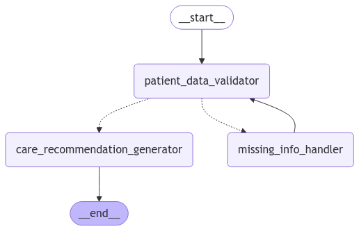

# Care Coordination System

## Overview
This application is a Care Provider Assistant that utilizes a state graph to manage patient data validation and care recommendations.


## Prerequisites
- Docker
- Docker Compose

## Getting Started


1. Build Docker Images
```bash
docker-compose up --build
```

2. Access the Application
- Gradio App: http://localhost:7860
- Flask API: http://localhost:5000

## Chatbot Flow




